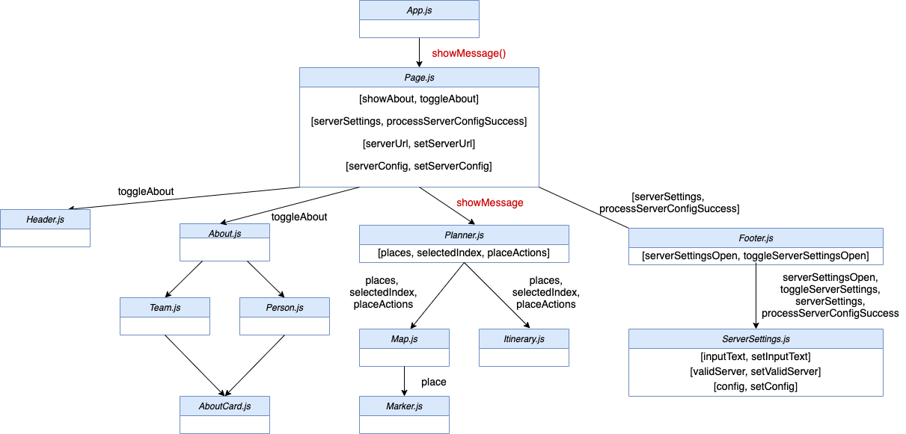
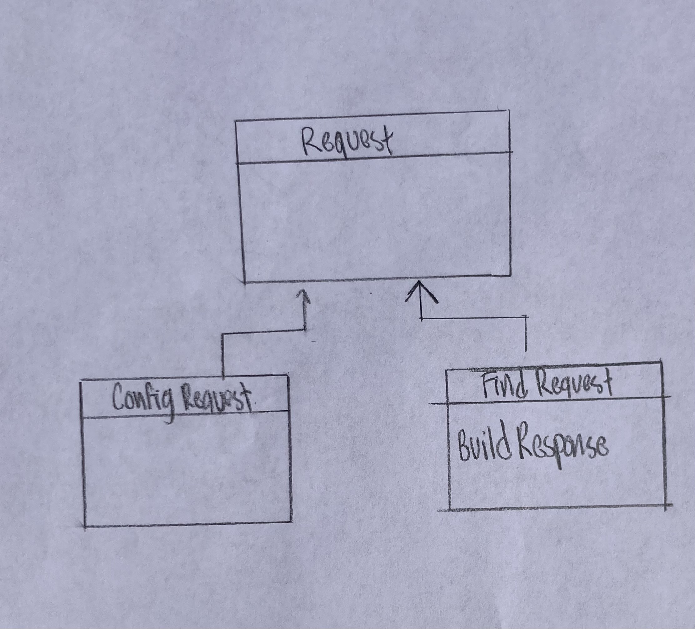
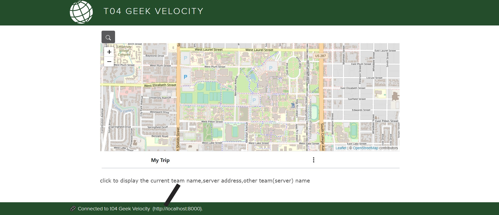
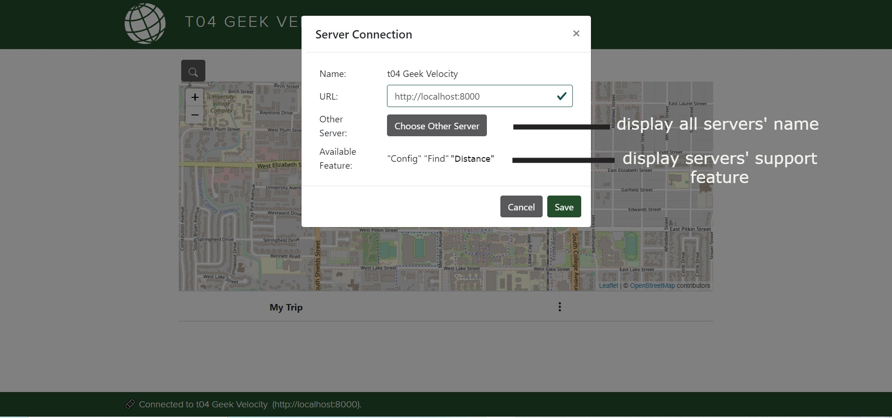
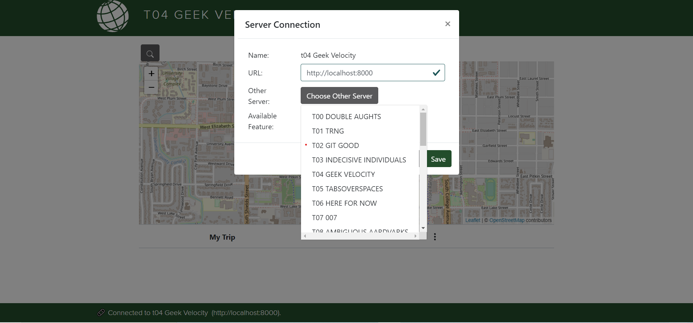
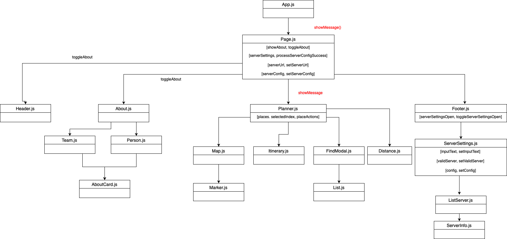
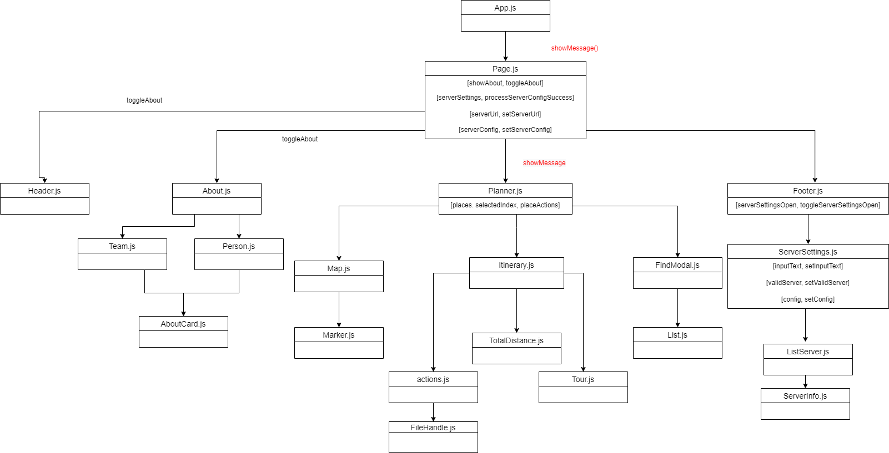

# Introduction

This document describes the architecture and design of a single page web application that interacts with microservices via RESTful APIs.
The key elements in this document include the architecture, user interface, client components, and server classes.

This is a living document that is updated as changes are made each sprint.
The initial document describes the Base code students are given as a starting point for the semester.
Students are expected to update this document as changes are made each sprint to reflect the evolution of their application and key decisions they make.
The Base section serves as an example.

# Base

The Base is a simple application to provide the architecture to the students at the beginning of the semester.
The JavaScript code will be useful examples for students to learn from and leverage in the code they write for sprint 1.
The progressive display of information using collapsible sections and popups will serve as examples of good user interface design.
The overall design is somewhat minimalist/simple for the intended mobile device audience.

### Architecture

The Base architecture is a JavaScript single page web application in an HTML5 browser that uses RESTful APIs to access Micro-services provided by a Java server running on Linux.
The client consists of a minimal index.html file that loads and executes the bundled JavaScript application.
The client and server files are bundled into a single JAR file for execution on the Linux server at a specified port.
The browser fetches the client files from the server on the specified port.

The browser loads the index.html file (by default) which in turn loads the bundled JavaScript single page application bundle.js.
* The single page application makes RESTful API requests to the server on the same port using  JavaScript's asynchronous fetch.  
* A protocol document describes the JSON format for the RESTful API requests and responses.
* JSON Schemas are used to verify requests on the server side and responses on the client side.
* On the client, ReactJS renders the application using ReactStrap, Leaflet, and application defined components.
* GSON is used on the server to convert JSON requests to Java objects and Java objects to JSON responses.
* The client (ulog) and server (SLF4J) logging mechanisms control debugging output during development and production - print statements and console logging should never be used. 

The following architecture elements are not included in the Base system.
They will be added later in the semester.
* Client filesystem.
* Server SQL.
* Server concurrency.

### User Interface

The basic screen in black shows the view on a mobile device, with a header, footer, and trip.
The header contains a earth logo and the team name obtained from the server when the client was loaded.
The footer contains a connection icon along with the current server name and server URL the client is connected to.
The trip shows a map and the current list of destinations.

Rather than buttons or icons to signify actions, we are associating actions with elements that are already on the screen to reduce the clutter.
We are using both popups and collapsible sections in this design rather than choosing to use one exclusively.
* Collapsible/Hidden sections are used for the map and about sections since they have a significant amount of content and we don't need to see them at the same time.
* A popup is used for the URL change since we want to control the interaction until the operation is completed. It seemed more natural than another collapsible section.

#### Clicking on the team name in the header displays an empty about screen.
Clicking again restores the trip screen.
We will fill this in later.

#### Clicking on the map adds to the trip.
Whenever a user clicks on the map, the client should display a marker with latitude, longitude, and a description at that location.
The description is obtained from reverse geocoding.
The location information is also added to the trip list below the map.
We only maintain a single marker at this point displaying the most recently clicked location.

#### Clicking the hamburgers (&#8942;) displays a menu of options.
At the trip level you can add the home (CSU Oval) location or clear the list.
At the destination level you can remove that destination from the list.

#### Clicking on the URL in the footer should let me change the server.
Whenever a user clicks on the URL a popup should open showing the team name, the URL in an input text box, and a Cancel button.
When the user modifies the URL, the client will attempt to connect to the new server and update the configuration.
When the Test button is clicked, it will attempt to connect to the server.
If not successful, nothing changes and the user may continue to make URL changes or click the Cancel button to return to the original sever (it shouldn't change).
If successful, the new server name should appear and a Save button should replace the Test button.
When the user clicks the Save button, the server connection should change and the popup closes, revealing the new servername and URL in the footer.

### Component Hierarchy
The component hierarchy for the base application depicted below shows the our top level App component with four children components.
* App renders the major components on the screen.
* Header renders an icon and a team name in the top banner.
* Footer renders the current server connection in the bottom footer.
* Atlas renders a map.
* About renders information about the team.

We do not show the many ReactStrap components in this hierarchy, even though they will appear when you are debugging on the client.

### Class Diagram
The class diagram for the base application depicted below shows the basic structure of the web server application.

The classes in blue represent the classes specific to this application.  
* WebApplication processes command line parameters and creates MicroServer.
* MicroServer start a web server on the given port, configures the server for security, static files, and APIs for different types of requests, and processes the requests as they arrive.
* JSONValidator verifies a request is properly formatted before attempting to process it using JSON Schemas.
* ConfigRequest is a specific request that allows the server to respond with its configuration to allow interoperability between clients and servers. 
* Request defines the basic components of all requests.
* BadReqeustException allows us to distinguish bad requests from other types of exceptions that may occur.

These test classes provide automated tests for unit testing.
* TestWebApplication
* TestConfigRequest
* TestJSONValidator

# Sprint 1

### User Interface

In this sprint, we will focus on team information.
There are two primary parts:
* browser tab, header, and footer.
* about page which includes team and member information,

Whenever a user clicks the team name in the header, a collapsible section should appear under the header with information about the team.
The collapsible map should disappear so only the about or map are displayed.
A simple toggle in state should be able to control this rendering.
The about page should contain the team name as a heading. 

The team name in the browser tab, header and are simple changes to constants in the client and server.

### Client Components

We will add 3 new components to the base architecture on the client to support the about page.
* Team component will render the team information
* Person component will render the individual information for a team member
* AboutCard component will render the team/individual information in a consistent fashion.

The existing About component will be modified to control the layout of the Team and Person components on the page.

### Server Classes
There are no changes to the server class structure in this sprint.
Only minor changes to text constants are required.

# Sprint 2

### User Interface

In this sprint, we will focus on adding new interface components to the map, and add features to trip configuration.
There are two primary parts:
* Find places
* Highlight place

When a user enters a simple string in a search bar, matching places and their details should appear in a list. 
The user can then select one or more places from the list to add to their trip. 
The user will be able to select and highlight a place in their trip list.

#### Drawing for #68 Highlight Place Epic

As the drawing shows, the highlighted place will have an H icon above it in the map portion of the interface. 
To make the highlighted place stand out, we are going to change a bit of css from the base code by :
* dropping the row css attribute that makes every other row of places bordered and filled in with a grey background. 
* changing the background color within the borders to a beige/light-green brackground. For lack of a beige colored pencil, this was not demonstrated in the drawing.  

### Drawing for #66 Find Places Epic

There will be a search button above the map. When clicked, a modal opens and contains a search bar in which a string may be input. When a string is input into the search bar and the button is clicked, a list will pop up underneath the bar and the user will be able to add an item from the list to their trip. We will be changing the code by:
* Adding a search button that pops up a modal 
* Adding in a search bar in the modal
* Adding in a list 
* Adding dynamic functionality to accomplish adding item from list

### Client Components

We will add two new components to the base architecture on the client to support the planner page.
* The FindModal component will render the search bar information
* The List component will render the information found when the user searches for a location

### Server Classes

The server class structure will change as a result of this sprint to provide new components and features for the user. 
* By enforcing the use of the find protocol for Epic #66 "Find Places", the server will change such that it supports valid find requests sent from the client. 

# Sprint 3

### User Interface

In this sprint, we will continue working on aspects that we started in the previous sprint as well as adding more features to the trip configuration. 
There will be 5 primary parts:
* Finish Find Places
* Finish Interoperability
* Trip Distances
* Where I am?
* Load Trip

The user will be able to add items from a list to the trip itinerary. 
The user will be able to see distances between each location on the trip itinerary. 

### Drawing for #246 Interoperability Epic

The interface of this epic would be add new line to the ServerSetting.js Bodyfunction. There will be two more line fo the dropdown menu to display each servers' name. And also a new line for display available feature of each server.We will change the code by:
* Adding a new List class on the Margins
* Adding a new SettingsRow for Other Server
* Add a new SettingsRow Rowsa label for "Available Feature"

### Drawing for #238 Distances Epic

Updates to the interface for this epic will add new features to the itinerary list. There will be an area for distance between each location added to the trip as well as the total distance of the trip. We will be changing the code by: 
* Add new table data to show distance between each place
* Add a new row at the top of the table to should round trip distance
* Add a label for "Round Trip Distance: "
* Add a button that generates distances array

### Drawing for #253 Load Trip

Changes to the User Interface are indicated by the lines and explanatory text. 

### Drawing for #244 Where Am I?

When a user would like to update the map to mark their current location, the My Trip hamburger will have an option to do so. 
This will update the default location of the Oval to their current location. 

The user will be prompted by the browser to allow their location. This will add a marker to the map relative to their current 
location and be displayed in the itinerary list. 

### Client Components

We will be adding the following components to the client:
* TotalDistance file to help render the distance between locations
* Functions to Itinerary to show distances on page
* Testing file for TotalDistance file

### Server Classes

Adding the following classes to the server:
* DistanceRequest.java
* Distance.java
* TestDistanceRequest.java

# Sprint 4 

### User Interface

During this sprint, the team will work on polishing features from the last sprint as well as add new features that will improve the usability of the site. 
There will be 3 primary parts:
* Save Trip
* Shorter Trip
* User Experience

The user will be able to save trips created via the itinerary. The user will also be able to create shorter, more efficient trips. Overall user experience will also be improved via outside feedback.

#### UI Improvements

The "Choose File" button to upload a file is not the most appealing feature compared to the other hamburger options in the "My Trip" dropdown. 
We will improve this by adding an icon for the user to click. By doing so, we are enhancing the overall User Interface.

### Drawing for #529 Save Trip 

Changes to the User Interface are indicated by the lines and explanatory text. 

### Drawing for #525 Shorter Trip

This epic interface will add a popup when a shorter trip is found compared to the current one. The map and the trip column will update the shortest trip when the user chooses to apply the shorter trip. And all the formats will keep the same when the user click the discard button.We will change the code by :
* Add a new class to handle or store the shorter trip data
* Add a new class for pop-up alert
* Update Itinerary for showing the new trip

### Drawing for #527 User Experience

After receiving feedback, changes were made to the icons used for adding a place to the trip. We also added an arrow icon that points down toward the itinerary in order to make it more clear where added places will show up. In order to clear up some confusion about the searching functionality, simple instructions were added to the modal above the input box. 

### Client Components

We will be adding the following components to the client: 
* File/functions to handle saving a trip from the intinerary
* Testing files for save trip file/function
* File/functions to handle shorter trip
* Testing files for shorter trip

### Server Classes

Adding the following classes
* TourRequest.java
* Tour.java
* TestTourRequest.java
* TestTour.java

# Sprint 5

### User Interface
During this sprint, the team will work on getting the site ready for release. This includes adding in some minor functionality through simple features and refining the features already present. There will be 7 major parts:
* Highlight Place
* Save Trip
* User Experience
* Trip Name
* Maps
* Where is?
* Random Places

### UI Improvements
The 'Find Distances' and 'Find Shorter Trip' buttons aren't the most appealing to the eye. For this sprint we will work on making distances auto complete when a new place is added to the itinerary, and remove the need for a button. We will also change the trip button to a more UI friendly design and possibly add it into the hamburger icon in order to ensure progressive disclosure on our site. 

### Drawing for #68 Highlight Place

This epic will add the functionality of being able to click a place in the itinerary list and see it highlighted on the map with a marker. It will also highlight the item in the list in a different color from the original table row.

### Drawing for #743 Save Trip

### Drawing for #744 User Experience

### Drawing for #768 Where Is

### Drawing for #7687 Progressive Disclosure

### Client Components

On the client side, we will be adding in new functions to handle changing the map background, changing the trip name, moving the map marker when a certain place is clicked and adding a new input box/button for the where is epic. 

### Server Classes

Server classes will remain the same. The following methods will be added to tour: 
* 2opt
* 2optImproves
* 2optReverse
